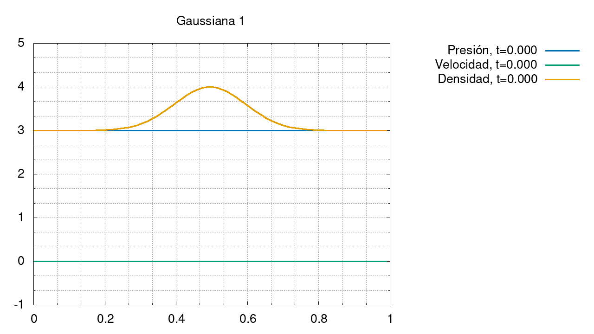
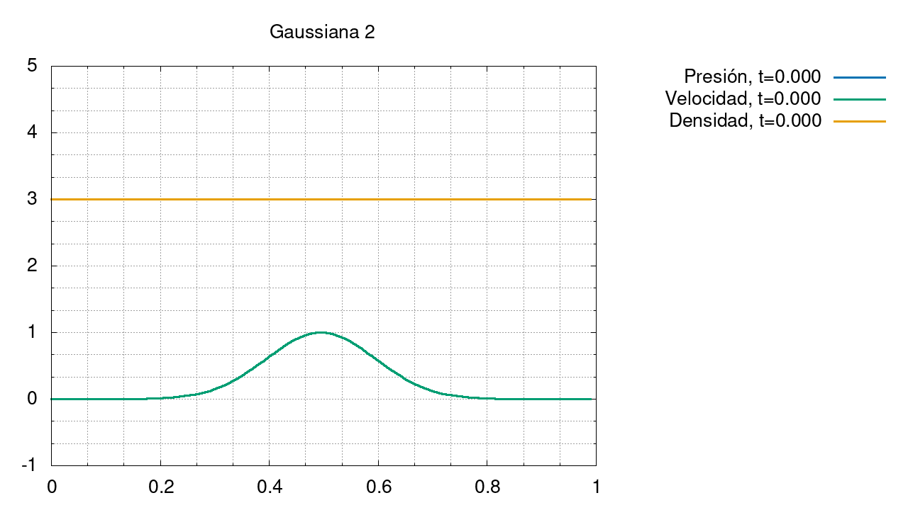
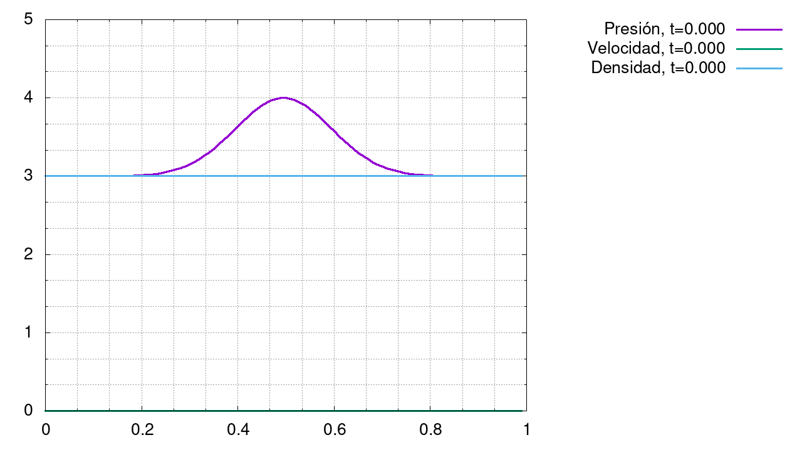
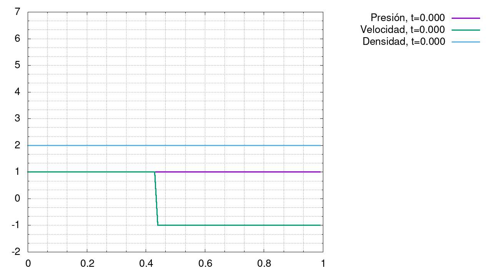
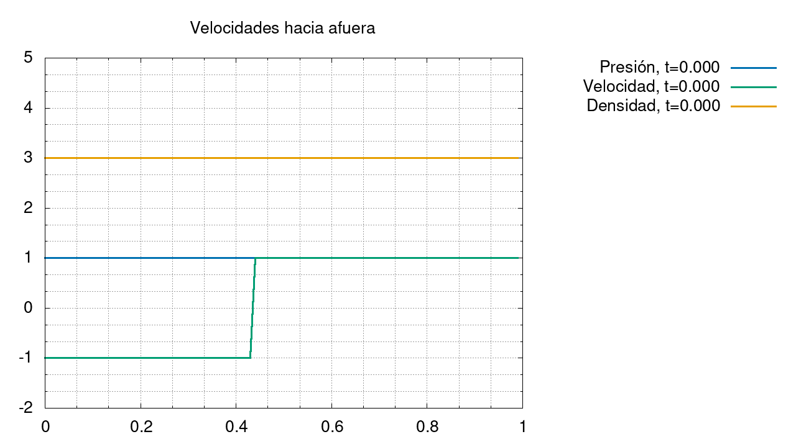
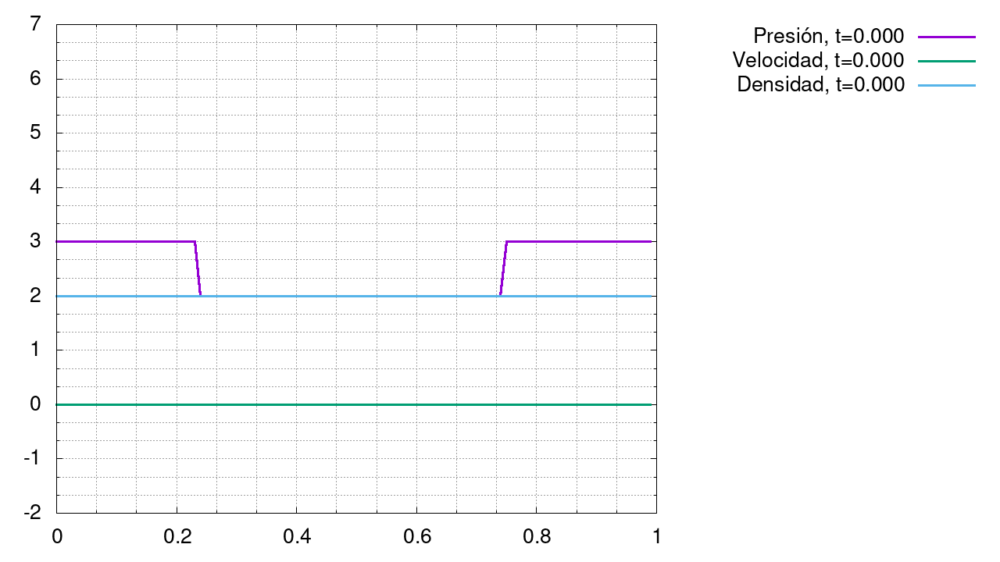

#   Proyecto física atmosférica 2021

Este folder contiene información pública sobre el proyecto realizado. Sin embargo, todo el código del proyecto está almacenado en un repositorio privado.

##  Códigos

*   [Generador de GIFs](Gnuplot-codes/Plot.gp)
*   [Generador de wavetables](Gnuplot-codes/3D_Plot.gp)[^1]

[^1]: El término "[wavetable](https://en.wikipedia.org/wiki/Wavetable_synthesis)" fue heredado de un tipo de síntesis en música, que emplea tipos de onda almacenados en archivos muy parecidos a este.

##  Gráficas

### Gaussiana 1:   

### Gaussiana 2:   

### Gaussiana 3:   

### Velocidades opuestas:   

### Velocidades hacia afuera:   

### Presión en los extremos:   
