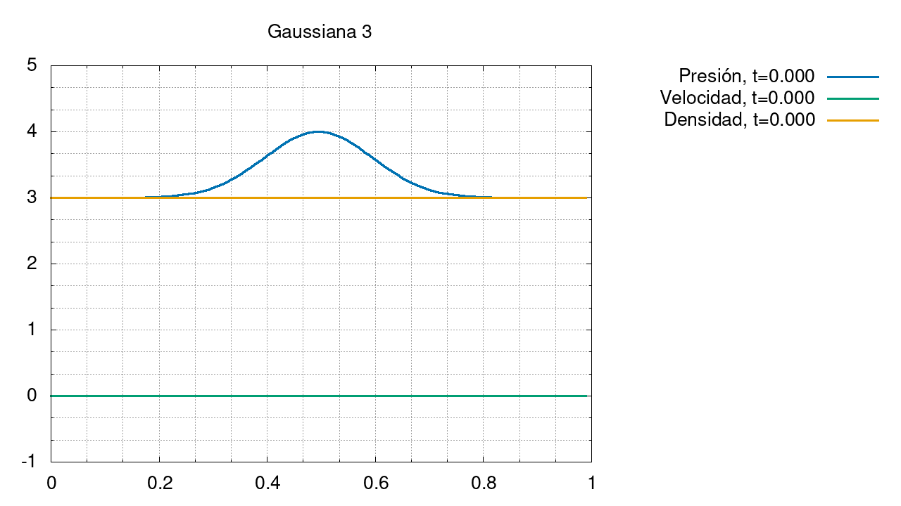
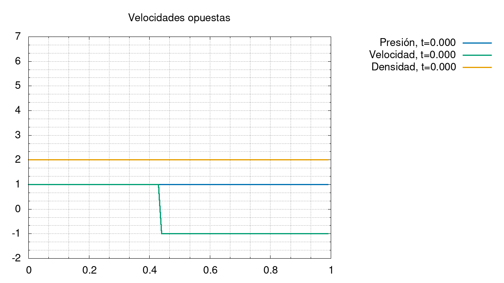
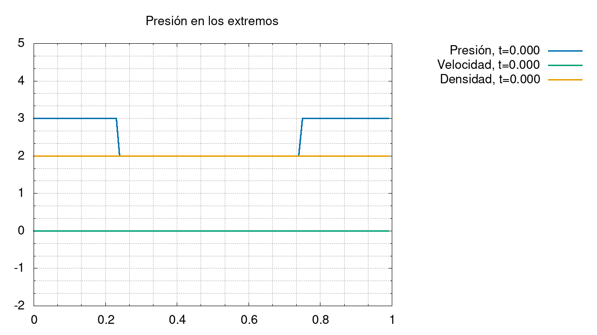

#   Proyecto física atmosférica 2021

Este folder contiene información pública sobre el proyecto realizado. Sin embargo, todo el código del proyecto está almacenado en un repositorio privado.

##  Gráficas

### Gaussiana 1:   

### Gaussiana 2:   

### Gaussiana 3:   

### Velocidades opuestas:   

### Velocidades hacia afuera:   

### Presión en los extremos:   
